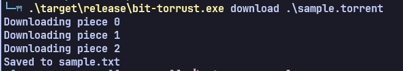

# bit-torrust
Yet another BitTorrent implementation in Rust, written to be easy to use, fast (I hope), bloat-free and ad-free.

## Demo

## Stuff Implemented
- [x] Downloading single files
- [ ] Downloading multifiles (Writing to disk not implemented)
- [ ] Async downloading
